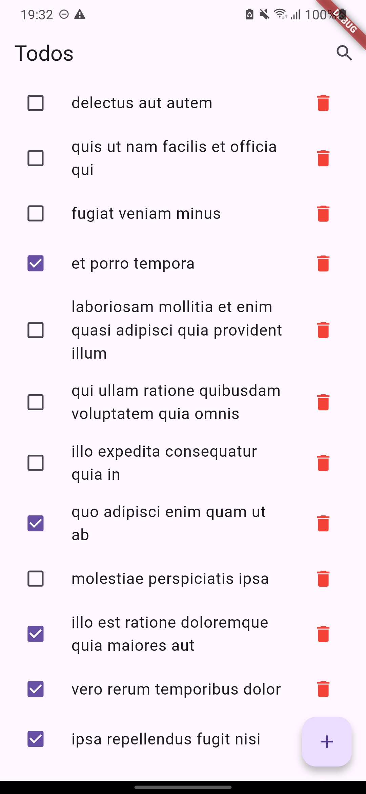
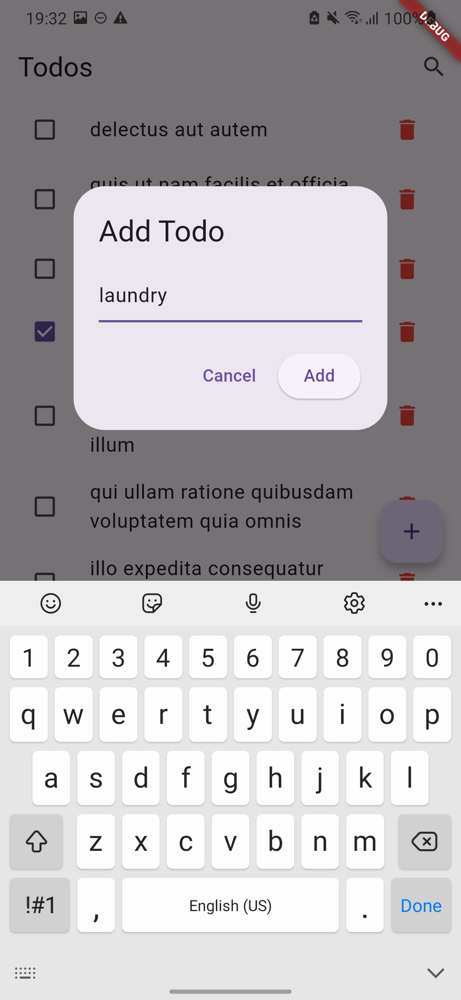
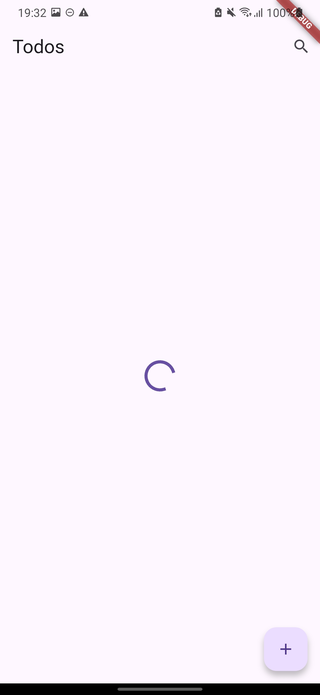
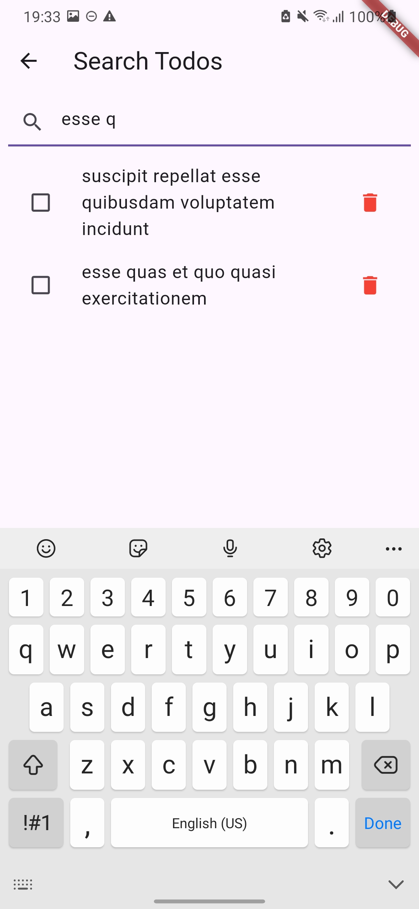

# 📌 To-Do List App with API

## 📖 Deskripsi

Aplikasi **To-Do List** yang terhubung dengan API Dummy ([JSONPlaceholder](https://jsonplaceholder.typicode.com)) untuk melakukan operasi **CRUD (Create, Read, Update, Delete)**.  
Aplikasi ini dibangun menggunakan pendekatan **Clean Architecture** dengan **Provider** sebagai state management, serta dukungan **SharedPreferences** untuk penyimpanan lokal.

---

## 🚀 Fitur Utama

- ✅ Menampilkan daftar tugas dari API menggunakan `FutureBuilder` dan `ListView.builder`
- ➕ Menambahkan tugas baru dengan `TextField` dan `ElevatedButton`
- ✔️ Menandai tugas sebagai selesai dengan `Checkbox` (PATCH request ke API)
- ❌ Menghapus tugas dari daftar (DELETE request ke API)
- 🔍 Mencari tugas berdasarkan nama/title
- 💾 Menyimpan data offline dengan **SharedPreferences**
- ⏳ Menampilkan **Loading Indicator** saat data diambil dari API

---

## 🛠️ Teknologi yang Digunakan

- **Flutter**
- **Provider** (State Management)
- **HTTP** (Komunikasi dengan API)
- **Dartz** (Functional Programming – Either untuk error handling)
- **SharedPreferences** (Penyimpanan lokal)
- **Clean Architecture** (Memisahkan domain, data, presentation)

---

---

## 📸 Screenshots

### 1. Daftar Tugas

Menampilkan semua To-Do dari API.  

### 2. Menambahkan Tugas Baru

Form input untuk menambahkan task baru.  

### 3. Loading State

Loading indicator ketika data sedang diambil dari API.  

### 4. Fitur Pencarian

Mencari To-Do berdasarkan title.  

---
